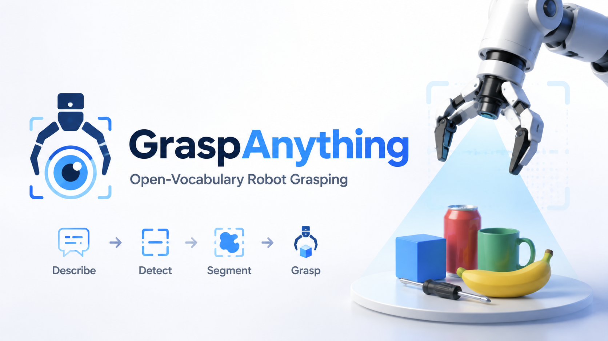
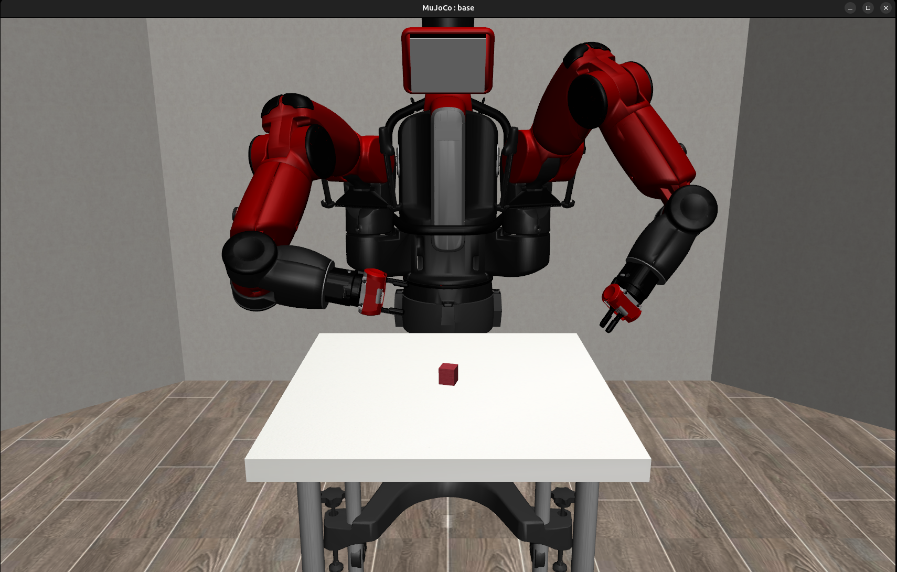

<p align="center">
  
</p>

<p align="center">
  <em>Tell it what to pick up — in plain English.</em>
</p>

<p align="center">
  <a href="#quick-start"><strong>Quick Start</strong></a> &nbsp;·&nbsp;
  <a href="#architecture"><strong>Architecture</strong></a> &nbsp;·&nbsp;
  <a href="#roadmap"><strong>Roadmap</strong></a>
</p>

---

**GraspAnything** is an open-vocabulary robot grasping system. Describe any object in natural language — `"the red cup"`, `"the banana on the left"`, `"the mug with a handle"` — and watch a robot arm find it, plan a grasp, and pick it up. All in simulation.

<p align="center">
  
</p>

---

## Why This Exists

| Project | Stars | Does | Missing |
|---------|-------|------|---------|
| [Grounded-SAM](https://github.com/IDEA-Research/Grounded-Segment-Anything) | 15k+ | Perception: text → detection → mask | **No action** — it sees, but doesn't *do* |
| [CLIPort](https://github.com/cliport/cliport) | 500+ | CLIP-driven robot manipulation | 2D tabletop blocks only, fixed objects |
| [VoxPoser](https://voxposer.github.io/) | 800+ | LLM → 3D value maps → robot action | Needs real hardware, hard to reproduce |
| **GraspAnything** | 🚀 | **Perception + Planning + Execution** | — |

> **The gap**: perception models that *see* everything, and robot frameworks that *move* — but nothing connecting them. GraspAnything bridges that gap.

## Quick Start

```bash
# 1. Clone
git clone https://github.com/amanannn/grasp-anything.git
cd grasp-anything

# 2. Create environment (Ubuntu 24.04: must use Python 3.10)
conda create -n grasp python=3.10 -y
conda activate grasp

# 3. Install dependencies
sudo apt install -y libosmesa6-dev libgl1-mesa-dev libegl1-mesa-dev
pip install mujoco==3.5.0
pip install robosuite

# 4. Verify
MUJOCO_GL=egl python -m robosuite.demos.demo_random_action
```

**[Compatibility note]** Ubuntu 24.04 ships Python 3.12, which breaks robosuite's offscreen rendering. Using conda Python 3.10 is the fix. MuJoCo must be `>=3.3.0,<3.10` — version 3.10.0 breaks the controller API.

## Architecture

```
User: "red cup"
  │
  ▼
┌──────────────────────────────────────────┐
│            Gradio Web UI                  │
│   ┌──────────┐  ┌──────────┐  ┌────────┐ │
│   │  Input   │  │  Step 1  │  │  Step 2│  │
│   │ "red cup"│  │Detection │  │  Mask  │  │
│   └──────────┘  └──────────┘  └────────┘ │
├──────────────────────────────────────────┤
│              Perception                   │
│  Grounding DINO → SAM → 3D Projection    │
├──────────────────────────────────────────┤
│              Execution                    │
│  Franka Panda arm · MuJoCo · robosuite   │
└──────────────────────────────────────────┘
```

**Pipeline + Stage design** — each stage runs independently with typed inputs/outputs, making the system testable and extensible:

| Stage | Input | Output |
|-------|-------|--------|
| `GroundingStage` | text + RGB image | detection boxes |
| `SegmentationStage` | RGB + detection boxes | instance masks |
| `ProjectionStage` | masks + depth + camera intrinsics | 3D grasp poses |
| `ExecutionStage` | grasp poses | grasp result + GIF |

## Tech Stack

| Layer | Technology |
|-------|-----------|
| Physics | MuJoCo (>=3.3,<3.10) |
| Robot | robosuite · Franka Panda |
| Detection | Grounding DINO-T |
| Segmentation | SAM ViT-H |
| Web UI | Gradio |
| Testing | pytest · ruff · pyright |

## Roadmap

- [x] **Project scaffold** — repo, design docs, environment verified
- [ ] **Phase 1: MVP** — full pipeline with 5 YCB objects, fixed top-down grasp
- [ ] **Phase 2: Gradio UI** — step-by-step web interface, one-click install
- [ ] **Phase 3: Quality** — PCA orientation, collision avoidance, >80% success
- [ ] **Phase 4: Release** — HuggingFace Spaces, Colab notebook, docs
- [ ] **Phase 4+: Agent** — LLM for complex instructions ("pick up the leftmost cup"), fine-tuned VLA model

## Coming Next

> **LLM Agent + Fine-tuned VLA** — moving from single-object grasping to understanding complex instructions like *"pick up the leftmost cup and place it on the right."* A small vision-language-action model fine-tuned on grasping demonstrations — research paper potential.

---

<p align="center">
  <sub>Built with MuJoCo · robosuite · Grounding DINO · SAM · Gradio</sub>
</p>
